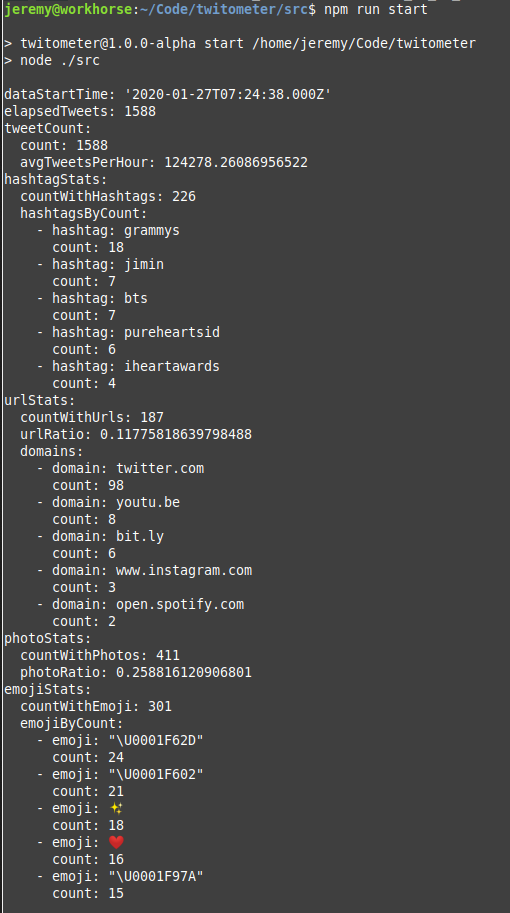

# Twitometer

A live twitter sample analysis tool.

## Functionality

This tool uses a live feed of sample statuses from Twitter's streaming API to provide basic statistics. Before use, you need to fill credentials for the Twitter API in the file `creds.json`.

To use it, you can run the default configuration with
```sh
npm install
npm run start
```

In default configuration, the data analyzed is limited to the last ten minutes. Data is rolled off and no longer factored into the statistics after that time window. You can increase or decrease the length of the data window by altering the configuration passed to WindowedProcessor in `src/index.js`. The console will update the statistics once per second until halted with signal 2.



## Tests

Run the unit tests with
```sh
npm test
```
Currently the data views are covered by tests.
